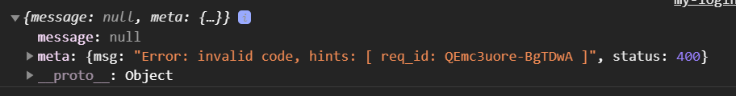

## 小程序开发
#### 1. 解决 uni-number-box 组件 数据不合法的问题

- 问题说明：当用户在 NumberBox 中输入字母等非法字符之后，会导致 NumberBox 数据紊乱的问题

```
//1. 打开根目录中 uni-modules/.../uni-number-box.vue 组件, 修改 methods 节点中的 _onBlur 函数如下：

_onBlur(event) {
  // 官方的代码没有进行数值转换，用户输入的 value 值可能是非法字符：
  // let value = event.detail.value;

  // 将用户输入的内容转化为整数
  let value = parseInt(event.detail.value);

  if (!value) {
    // 如果转化之后的结果为 NaN，则给定默认值为 1
    this.inputValue = 1;
    return;
  }

  // 省略其它代码...
}
```

#### 2. uni-swipe-action 滑块组件中 onClick方法 执行两次解决方法

- 问题: 购物车商品滑块删除 一次删除两个商品
- 分析: 组件内部中有两个.js文件同时使用了 emit()传递了 click事件,才导致调用了两次
- 解决方法: 将其中一个js文件对应的代码注释掉, 解决了这个问题, 没有其他的bug
[解决方法](https://blog.csdn.net/hongyu799/article/details/116275123)

```
<uni-swipe-action>
  <!-- 基础用法 -->
  <uni-swipe-action-item :right-options="options" @click="onClick">
    <view>基础使用</view>
  </uni-swipe-action-item>
</uni-swipe-action>
```

#### 3. 解决收货地址授权失败的问题
- 问题: 当获取用户地址, 用户取消授权, 下次无法在获取用户地址问题

```
// 选择收货地址
async chooseAddress() {
  // 1. 调用小程序提供的 chooseAddress() 方法，即可使用选择收货地址的功能
  const [err, success] = await uni.chooseAddress().catch(err => err)

  // 2. 用户成功的选择了收货地址
  if (success && success.errMsg === 'chooseAddress:ok') {
    // 更新 vuex 中的收货地址
    this.updateAddress(success)
  }

  // 3. 用户没有授权
  if (err && err.errMsg === 'chooseAddress:fail auth deny') {
    this.reAuth() // 调用 this.reAuth() 方法，向用户重新发起授权申请
  }
},

// 调用此方法，重新发起收货地址的授权
async reAuth() {
  //1. 提示用户对地址进行授权
  const [err2, confirmResult] = await uni.showModal({
    content: '检测到您没打开地址权限，是否去设置打开？',
    confirmText: "确认",
    cancelText: "取消",
  })

  //2. 如果弹框异常，则直接退出
  if (err2) return

  //3. 如果用户点击了 “取消” 按钮，则提示用户 “您取消了地址授权！”
  if (confirmResult.cancel) return uni.$showMsg('您取消了地址授权！')

  //4. 如果用户点击了 “确认” 按钮，则调用 uni.openSetting() 方法进入授权页面，让用户重新进行授权
  if (confirmResult.confirm) return uni.openSetting({
    // 4.1 授权结束，需要对授权的结果做进一步判断
    success: (settingResult) => {
      //4.2 地址授权的值等于 true，提示用户 “授权成功”
      if (settingResult.authSetting['scope.address']) return uni.$showMsg('授权成功！请选择地址')
      //4.3 地址授权的值等于 false，提示用户 “您取消了地址授权”
      if (!settingResult.authSetting['scope.address']) return uni.$showMsg('您取消了地址授权！')
    }
  })
}
```

#### 4. 前后端AppID不一致 无法获取token 和具体的用户信息


```
// 换取 token
const { data } = await uni.$http.post('/api/public/v1/users/wxlogin', query)

//前后端AppID不一致 无法获取数据  只能模拟获取成功(将判断语句注释, 在传一个模拟的token值)
// if (data.meta.status !== 200) return uni.showMsg('登录失败！')
uni.showMsg('登录成功')
```